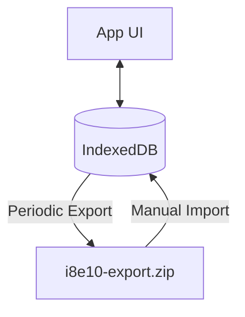

# Data Persistence | தரவு நிலைத்தன்மை

i8e10 is a **Local-First** application. This means data is primary to the device it was created on, rather than a central server.

## IndexedDB Strategy | IndexedDB உத்தி
The application uses **IndexedDB** as its persistent storage engine, wrapped in a custom logic layer (`utils/db.ts`).

### Schema Evolution | ஸ்கீமா வளர்ச்சி
The database schema follows an incremental versioning system.
- **V1/V2**: Legacy structure using direct JSON storage.
- **V3 (Current)**: Transition to a **Double-Entry Ledger** system. This version includes a complex migration utility (`utils/migrationV3.ts`) that converts old transaction logs into balanced ledger entries.

### Middleware Layer | மிடில்வேர் அடுக்கு
Every database operation passes through a middleware layer that handles:
1. **Encryption**: Transparently encrypting sensitive fields before they hit the disk.
2. **Deterministic IDs**: Generating IDs based on content or context to prevent duplicates during sync/import.
3. **Double-Entry Validation**: Ensuring that every financial change affects at least two accounts (Debit/Credit).

## Data Portability & Safety | தரவு பெயர்வுத்திறன் மற்றும் பாதுகாப்பு
Because the browser's IndexedDB can be cleared by the OS during low-storage events, the app treats the database as "persistent but volatile."

- **Persistence**: Data stays on the device across refreshes and restarts.
- **Portability**: Data can be moved between devices via the [[Backup System]].
- **Safety**: Multi-layered encryption ensures that even if the database file is accessed, the contents are unreadable without the password.

## Interlinks | இணைப்புகள்
- [[Core Database]] - Technical schema details.
- [[Auth & Encryption]] - Security layer for persisted data.
- [[Backup System]] - How persistence is extended to external storage.
