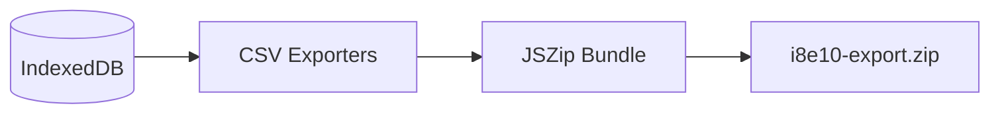

# Backup System | காப்புப்பிரதி அமைப்பு

Since i8e10 is a local-first application, the user is solely responsible for their data. The backup system ensures that data can be easily exported, stored externally, and restored.

## Backup Reminders | காப்புப்பிரதி நினைவூட்டல்கள்
The app actively encourages regular backups through the `BackupReminderBanner`.
- **Initial Backup**: Shown immediately after the first setup to establish a baseline.
- **7-Day Threshold**: Triggers if the `lastBackupDate` (stored in settings) is more than 7 days old.
- **Dismissal**: Users can "Remind Me Later," which snoozes the banner for the current session.

## Export Pipeline | ஏற்றுமதி குழாய்
The export process bundles all application state into a single portable package.

- **CSV Generation**: `utils/csvExporter.ts` converts every table (Transactions, Debts, Investments, Accounts) into standardized CSV strings.
- **Compression**: `utils/zipExporter.ts` uses `JSZip` to compress these files into a single `.zip` archive for easy handling.

## Import & Recovery | இறக்குமதி மற்றும் மீட்பு
Restoring data involves reversing the export process.
- **Zip Extraction**: The app reads the uploaded `.zip` file and extracts individual CSV components.
- **Parsing & Validation**: `utils/csvImporter.ts` parses each CSV, validates the schema, and prepares the data for database insertion.
- **Idempotency**: The system uses deterministic IDs to prevent duplicate entries during repeated imports.

## Portability | பெயர்வுத்திறன்
Because backups are stored as standard CSV files within a Zip archive, users can view their data in any spreadsheet software (Excel, Google Sheets), ensuring long-term data sovereignty even without the app.

## Interlinks | இணைப்புகள்
- [[Data Persistence]] - How data is stored between backups.
- [[Auth & Encryption]] - Why backups are necessary (forgotten passwords).
- [[User Journey]] - Where backup fits into the engagement lifecycle.
