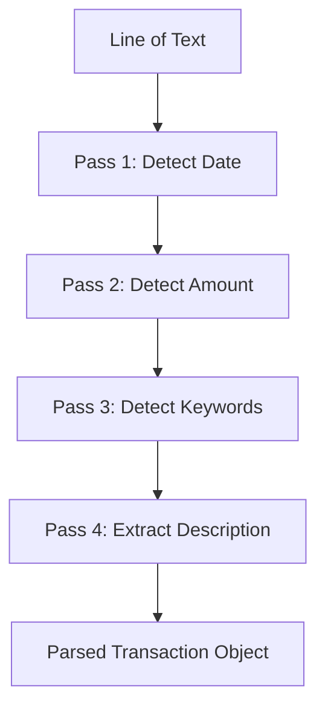

# Bulk Add | மொத்தமாகச் சேர்த்தல்

The Bulk Add feature allows users to enter multiple transactions quickly using a free-form, natural language text input.

## Multi-Pass Parser | பல-பாஸ் பாகுபடுத்தி
The core logic resides in `utils/bulkAddParser.ts`, which uses a multi-pass approach to extract transaction details from each line of text.

### Parsing Rules | பாகுபடுத்தும் விதிகள்
1. **Date**: Looks for ISO (YYYY-MM-DD), Indian (DD-MM-YYYY), or relative terms like "today" and "yesterday".
2. **Amount**: Identifies the last numeric value in the line as the most reliable candidate for the transaction amount.
3. **Type**: Scans for keywords like "income", "received", "credited" (Income) or assumes "Expense" by default.
4. **Description**: Any remaining text that wasn't identified as a date, amount, or type keyword becomes the description.

## UI Feedback | பயனர் இடைமுக பின்னூட்டம்
The `BulkAddModal` provides real-time validation:
- **Valid Lines**: Shown with a green checkmark and a preview of the parsed data.
- **Invalid Lines**: Highlighted with specific error messages (e.g., "Could not find a valid amount").

## Transaction Creation | பரிவர்த்தனை உருவாக்கம்
Once confirmed, all valid lines are processed in a single database transaction. The app assigns a default wallet and date for any missing fields to ensure ledger integrity.

## Interlinks | இணைப்புகள்
- [[Accounting System]] - Where bulk transactions are eventually recorded.
- [[Double-Entry Ledger]] - The target data model for bulk entries.
