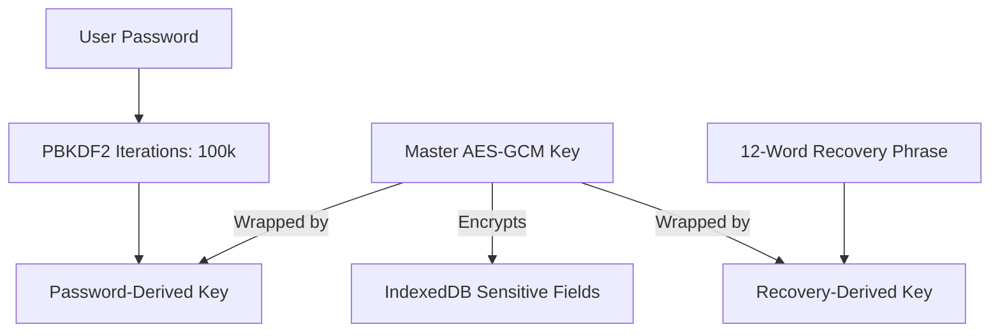

# Auth & Encryption | அங்கீகாரம் மற்றும் குறியாக்கம்

i8e10 uses a **Zero-Knowledge Encryption** architecture to ensure that your financial data remains private and secure, even from the application itself.

## Architecture Overview | கட்டடக்கலை மேலோட்டம்

The system relies on a multi-layered key hierarchy where the user's password never leaves the browser in its raw form.

## Zero-Knowledge Implementation | ஜீரோ-நாலேட்ஜ் செயலாக்கம்

### 1. Master Key Generation | முதன்மை திறவுகோல் உருவாக்கம்
During the initial setup, the app generates a random 256-bit AES-GCM **Master Key**. This key is the root of all data encryption.

### 2. Key Wrapping | திறவுகோல் மடித்தல்
The Master Key is never stored in plain text. Instead, it is "wrapped" (encrypted) using:
- **Password-Derived Key**: Generated via PBKDF2 using the user's password and a random salt.
- **Recovery-Derived Key**: Generated via PBKDF2 using the 12-word recovery phrase.

### 3. Verification String | சரிபார்ப்பு சரம்
To verify the user's password without storing the password itself, a static "Verifier String" is encrypted with the Master Key.
- **Unlock Flow**: The app attempts to unwrap the Master Key using the provided password. If successful, it tries to decrypt the Verifier String. A successful decryption proves the password is correct.

## Sensitive Data Encryption | முக்கிய தரவு குறியாக்கம்

Encryption is handled at the database middleware level in `utils/db.ts`.

### Encrypted Fields | குறியாக்கப்பட்ட புலங்கள்
Fields marked as sensitive (e.g., `amount`, `description`, `note`) are intercepted during database operations:
- **Write**: Data is encrypted using the Master Key before being written to IndexedDB.
- **Read**: Data is decrypted using the Master Key before being returned to the UI.

## Thread Isolation (Worker) | த்ரெட் தனிமைப்படுத்தல்
To maintain UI responsiveness during heavy cryptographic operations (like PBKDF2), all crypto logic runs in a dedicated **Web Worker** (`utils/crypto.worker.ts`). The main thread only holds the imported `CryptoKey` in memory for the duration of the session.

## Interlinks | இணைப்புகள்
- [[Core Database]] - Where encrypted data is stored.
- [[Recovery Flow]] - How the Master Key is recovered if the password is lost.
