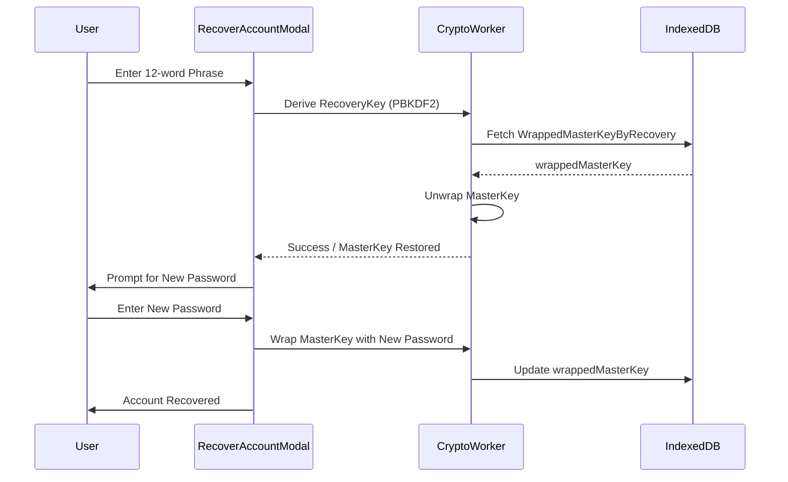

# Recovery Flow | மீட்பு செயல்முறை

The recovery flow allows users to regain access to their encrypted data if they forget their password, using a 12-word recovery phrase.

## The 12-Word Phrase | 12-சொல் சொற்றொடர்
During setup, a 12-word phrase is generated using a subset of the BIP-39 wordlist. This phrase is the **only** way to recover data; if lost, the data is permanently inaccessible.

## Security Mechanism | பாதுகாப்பு பொறிமுறை

### 1. Dual Wrapping | இரட்டை மடிப்பு
The **Master Key** is stored in two wrapped forms in the database:
1. `wrappedMasterKey`: Encrypted with the user's password.
2. `wrappedMasterKeyByRecovery`: Encrypted with the 12-word recovery phrase.

### 2. Phrase Hashing | சொற்றொடர் ஹேஷிங்
A SHA-256 hash of the recovery phrase is stored during setup (`recoveryPhraseHash`). When a user attempts recovery, the app first verifies that the provided phrase matches this hash before attempting the expensive PBKDF2 derivation.

## Best Practices | சிறந்த நடைமுறைகள்
- Users are instructed to store the phrase offline (paper or hardware vault).
- The phrase is only shown once during the initial setup.
- The recovery flow resets the password but preserves all existing encrypted data.

## Interlinks | இணைப்புகள்
- [Auth & Encryption](auth-and-encryption.md) - The underlying key hierarchy.
- [Core Database](../modules/core-database.md) - Where the wrapped keys are persisted.
