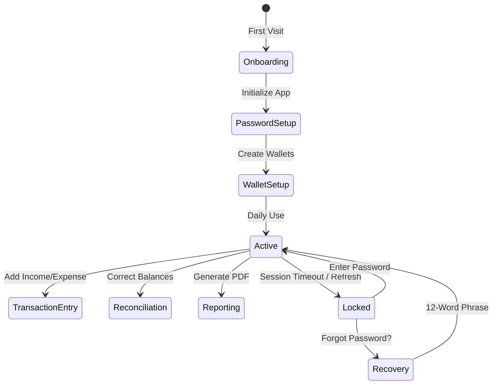

# User Journey | பயனர் பயணம்

The user journey in i8e10 is designed to move from high-friction setup to low-friction daily maintenance.

## Phases of Engagement | ஈடுபாட்டின் நிலைகள்

## 1. Initialization | தொடக்கம்
Users are greeted with a quick [[Onboarding Guide]] explaining the core concepts of privacy and double-entry. They then set up a password and secure their 12-word phrase.

## 2. Daily Maintenance | தினசரி பராமரிப்பு
The primary engagement is logging transactions. Users can use:
- **Manual Add**: Single entry for precise logging.
- **[[Bulk Add]]**: For quickly clearing a backlog of transactions.

## 3. Review & Correction | மதிப்பாய்வு மற்றும் திருத்தம்
Users visit the "Health" view to check their savings ratio and net flow. If they notice discrepancies between the app and reality, they use **[[Forgiving Reconciliation]]** to align balances without investigating past history.

## 4. Archival & Reporting | காப்பகம் மற்றும் அறிக்கை
Periodically, users generate an **[[Income Statement]]** PDF for their records or external use.

## Interlinks | இணைப்புகள்
- [[Auth & Encryption]] - The security foundation of the journey.
- [[Forgiving Reconciliation]] - The low-friction correction mechanism.
- [[Income Statement]] - The output of the journey.
