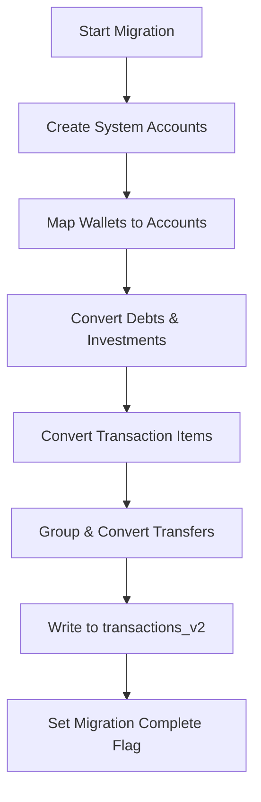

# Accounting System | கணக்கியல் அமைப்பு

The core logic that implements professional-grade double-entry accounting within i8e10.

## Intent | நோக்கம்
To provide a robust, error-resistant accounting engine that supports complex financial flows (debts, investments, transfers) while maintaining a balanced ledger.

இரட்டைப் பதிவு முறையைப் பயன்படுத்தி நிதியைத் துல்லியமாகக் கண்காணிப்பது மற்றும் பழைய தரவை புதிய முறைக்கு மாற்றுவது.

## Architecture | கட்டடக்கலை
The system is divided into three layers:
1. **Core Models**: Defined in `doubleEntryTypes.ts` and `accounts.ts`.
2. **Adapter Layer**: `accountingAdapter.ts` provides a high-level API for the UI.
3. **Migration Layer**: `migrationV3.ts` handles the one-time conversion of legacy single-entry data.

### Chart of Accounts | கணக்கு அட்டவணை
Every entity is an `Account` with a specific type:
- **Asset**: Wallets, Receivables, Investments.
- **Liability**: Debts Payable, Credit Cards.
- **Income**: Revenue sources.
- **Expense**: Spending categories.
- **Equity**: Opening balances and adjustments.

### Migration Pipeline | இடப்பெயர்வு செயல்முறை

## Implementation Details | அமலாக்க விவரங்கள்
- **Deterministic IDs**: Account IDs for wallets, debts, and investments are generated deterministically (e.g., `acc_wallet_cash`) to ensure idempotency during migration.
- **Validation**: Every transaction is validated via `validateBalancedEntries` before being saved to the database.

## Lessons Learned | கற்றுக்கொண்ட பாடங்கள்
- **Idempotency**: The migration pipeline must be safe to run multiple times (idempotent) in case of interruptions.
- **Traceability**: Storing the `sourceId` of the legacy transaction in the `meta` field of the new double-entry transaction is vital for debugging migration errors.

[[Double-Entry Ledger]] | [[Double-Entry Ledger]]
[[Core Database]] | [[Core Database]]
