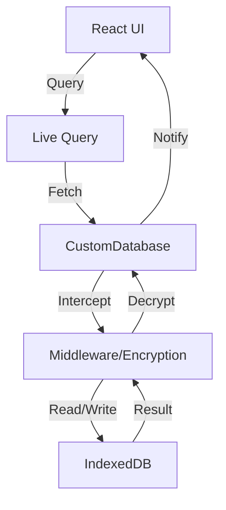

# Core Database | முதன்மை தரவுத்தளம்

The system uses a custom IndexedDB wrapper designed for offline-first, private-first financial tracking.

## Intent | நோக்கம்
To provide a secure, reactive, and transactional data layer that abstracts the complexities of IndexedDB while ensuring client-side encryption.

குறியாக்கவியல் மற்றும் எதிர்வினை புதுப்பிப்புகளுடன் கூடிய IndexedDB-க்கான பாதுகாப்பான தரவு அடுக்கை வழங்குவது.

## Architecture | கட்டடக்கலை
The database is managed by the `CustomDatabase` singleton, which provides a Dexie-like API.

தரவுத்தளம் `CustomDatabase` என்ற ஒற்றை முறை (Singleton) மூலம் நிர்வகிக்கப்படுகிறது.

### Key Components | முக்கிய கூறுகள்
- **TableProxy**: Provides a clean interface for table operations (`get`, `put`, `add`, `delete`).
- **Middleware**: Intercepts operations for encryption/decryption.
- **Live Query**: A reactive system that notifies subscribers of database changes via an `EventEmitter`.
- **Transactions**: Supports atomic operations across multiple stores with nested transaction depth tracking.

### Schema | திட்டம்
The database name is `i8e10DB`. Key tables include:
- `transactions_v2`: The double-entry ledger.
- `accounts`: The Chart of Accounts.
- `settings`: App configuration and encryption keys.

## Data Flow | தரவு ஓட்டம்

## Lessons Learned | கற்றுக்கொண்ட பாடங்கள்
- **Transaction Depth**: Tracking nested transactions is crucial to prevent premature change notifications during multi-step operations.
- **Middleware Error Handling**: Middleware should gracefully fallback to original results if encryption/decryption fails to avoid breaking the UI.

[[Accounting System]] | [[Accounting System]]
[[Local-First Security]] | [[Local-First Security]]
