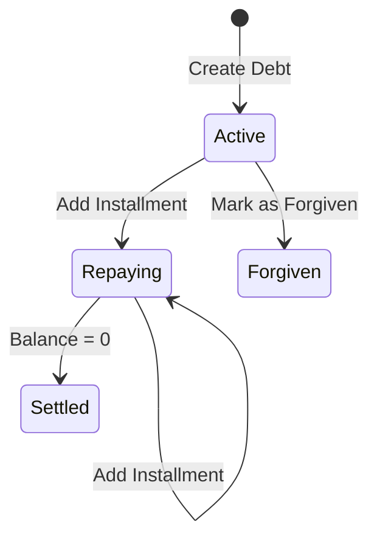

# Debt Management | கடன் மேலாண்மை

The Debt module tracks lending and borrowing, ensuring that these liabilities and assets are correctly represented in the overall financial health.

## Core Entities | முக்கிய உட்பொருள்கள்
- **Debt**: A record of a principal amount, a counterparty, and a type (Lent/Borrowed).
- **Debt Installment**: A record of a repayment toward a specific debt.

## Lifecycle of a Debt | கடனின் வாழ்க்கைச் சுழற்சி

### 1. Creation | உருவாக்கம்
When a debt is created, it affects the [[Double-Entry Ledger]]:
- **Lent**: Wallet (Credit) -> Debt Account (Debit).
- **Borrowed**: Debt Account (Credit) -> Wallet (Debit).

### 2. Repayment | திருப்பிச் செலுத்துதல்
Installments are tracked individually and linked to the parent debt. Each installment generates a corresponding ledger entry to reduce the outstanding balance.

### 3. Closure | நிறைவு
- **Settled**: When installments equal the principal.
- **Forgiven**: Using the [[Forgiving Reconciliation]] pattern, a debt can be closed without full repayment, balancing the discrepancy against the Equity account.

## Tamil Terminology | தமிழ் கலைச்சொற்கள்
- **Lent**: கொடுத்த கடன் (Asset)
- **Borrowed**: வாங்கிய கடன் (Liability)
- **Installment**: தவணை

## Interlinks | இணைப்புகள்
- [[Accounting System]] - How debt transactions are recorded.
- [[Forgiving Reconciliation]] - Used for closing bad debts.
