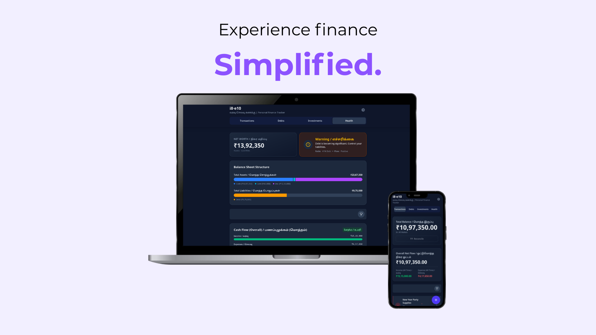

# i8·e10 — Personal Finance Ledger & Wealth Manager

**A secure, private, and powerful personal finance tracker that works entirely offline. All your data stays on your device, protected by strong encryption.**

i8·e10 is designed for clarity and ease of use, helping you manage your finances without the need for an account or an internet connection. Its bilingual English/Tamil interface makes it accessible to a wider audience.



---

## 🧐 What’s in a name?


The name i8·e10 is a contraction of Income 8 and Expense 10. It is a modern nod to the classic Tamil song lyrics:

> வரவு எட்டணா,
> செலவு பத்தனா;
> அதிகம் இரண்டனா
> கடைசியில் துண்டனா

*(Income is 8 annas, Expense is 10 annas; The extra 2 annas lead to a deficit in the end.)*

The app serves as a tool to help you track that very balance and ensure your "expense" never overtakes your "income"

---

## ✨ Key Features

-   **🔒 Encrypted & Private:** Your financial data is yours alone. All information is encrypted and stored locally in your browser using the Web Crypto API. Your password is the only key, and it never leaves your device. No accounts, no cloud, no tracking.
-   **🔑 Secure Password & Recovery:** The app is protected by a password you set. If you forget it, a unique 12-word recovery phrase—generated during setup—is the only way to regain access to your data.
-   **📊 Comprehensive Tracking:** Go beyond simple expense tracking.
    -   **Transactions:** Log income, expenses, and wallet-to-wallet transfers.
    -   **Debts:** Keep a clear record of money you've lent and money you owe, with settlement tracking.
    -   **Investments:** Monitor the performance of your assets like stocks, mutual funds, and real estate, including contributions, withdrawals, and dividends.
-   **🌐 Bilingual Interface:** A clean, intuitive interface available in both English and Tamil (தமிழ்).
-   **⚡️ Smart & Fast Entry:**
    -   **Quick Add Button:** A quick tap adds the most common item (like an expense). A long-press reveals options to add transactions, debts, or investments.
    -   **Bulk Add:** Paste multiple transactions in plain text and let the app parse them for you in seconds.
-   **⚖️ Easy Balance Reconciliation:** Quickly adjust your wallet balance to match your actual cash or bank account total with a simple, guided tool.
-   **🔍 Powerful Filtering:** Instantly filter your transactions, debts, and investments by various criteria like time periods, wallets, types, and status.
-   **💾 Secure Data Backup & Restore:** Export all your financial data—transactions, debts, and investments—into separate CSV files, conveniently packaged in a single ZIP file. This serves as a secure, unencrypted backup for your records or for use in other applications.
-   **🔔 Smart Reminders:** Get automatic reminders to back up your data, ensuring you don't lose your financial history.
-   **🎨 Customizable Experience:**
    -   **Wallet Management:** Create and manage multiple "wallets" like Cash, Bank, or Credit Card.
    -   **Dark & Light Modes:** Switch between themes to suit your preference.
    -   **Onboarding Guide:** A helpful tutorial to get you started, which you can revisit anytime from the settings.

---

## 🚀 Production Setup

i8·e10 is a static web application and requires no backend. You can host it easily on any static hosting provider (like Vercel, Netlify, GitHub Pages) or run it on your own server.

1.  **Download the files:** Get the latest version of release containing the built project.
2.  **Serve the directory:** Use any static file server to serve the root directory containing `index.html`.

Here's a quick way to run it locally using `npx`:

```bash
# Make sure you are in the project's root directory
npx serve .
```

Now you can access the application at the URL provided by the command (usually `http://localhost:3000`).

### Docker

You can also run i8e10 using Docker:

1.  **Build the image:**
    ```bash
    docker build -t i8e10 .
    ```
2.  **Run the container:**
    ```bash
    docker run -p 3000:80 i8e10
    ```
3.  **Using Docker Compose:**
    ```bash
    docker-compose up -d
    ```

---

## 👨‍💻 Development Setup

Interested in contributing or running the project for development? Follow these steps.

### Prerequisites

-   [Node.js](https://nodejs.org/) (v18 or higher recommended)
-   An `npm` compatible package manager (e.g., `npm`, `pnpm`, `yarn`)

### Instructions

1.  **Clone the Repository**
    ```bash
    git clone https://github.com/svijaykoushik/i8e10.git
    cd i8e10
    ```

2.  **Environment Variables**

    The application uses environment variables for configuration. You can create a `.env` file in the root directory to define these variables locally during development.

3.  **Run the Development Server**

    This project is set up to run with a simple static server, as all modules are handled by the browser via import maps.

    ```bash
    # This will start a local server, typically at http://localhost:3000
    npx serve .
    ```
    The server will host the files, and you can open the provided URL in your browser to see the application. Most static servers provide hot-reloading functionalities for a smoother development experience.

---

## 🛠️ Tech Stack

-   **Framework:** React 19
-   **Language:** TypeScript
-   **Styling:** Tailwind CSS v4
-   **Database:** IndexedDB (via Dexie.js)
-   **Security:** Web Crypto API for client-side encryption
-   **Icons:** Heroicons
-   **Packaging:** JSZip (for CSV export)

---

## 🤝 Contributing

Contributions are welcome! If you have ideas for new features, bug fixes, or improvements, please feel free to:

1.  Fork the repository.
2.  Create a new branch (`git checkout -b feature/your-awesome-feature`).
3.  Make your changes and commit them (`git commit -m 'Add some feature'`).
4.  Push to the branch (`git push origin feature/your-awesome-feature`).
5.  Open a pull request.

---

## 📄 License

This project is licensed under the AGPL License. See the [LICENSE](LICENSE) file for details.
